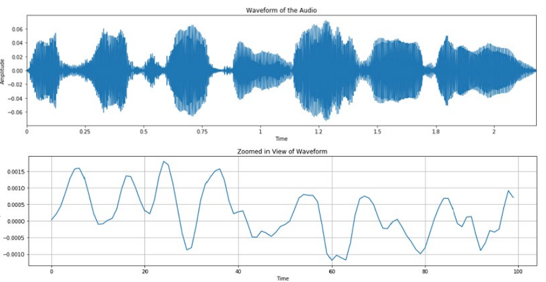
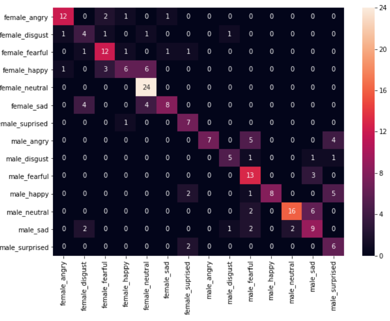

Voice Classification Using ML and Recognize the Emotion Behind the Tone Project Assigned By - Compsoft Technologies

Dependencies Used:
Librosa
Numpy
Soundfile
Scikit-learn
PyAudio

Preparing the Dataset: Here, we download and convert the dataset to be suited for extraction.
Loading the Dataset: This process is about loading the dataset in Python which involves extracting audio features, such as obtaining different features such as power, pitch, and vocal tract configuration from the speech signal, we will use librosa library to do that.

Training the Model: After we prepare and load the dataset, we simply train it on a suited sklearn model.

Testing the Model: Measuring how good our model is doing.
->We use MFCC, Chroma, and Mel Frequency Cepstrum as speech features

***We Obtained Accuracy of 75%
 
 other datasets such as Emo-DB and TESS and tweak the model (or use another one) if you wish to get better performance

 | Team : SHIVANANDA S BELAGAVI | SIDDHARTH PRIYADARSHI V

